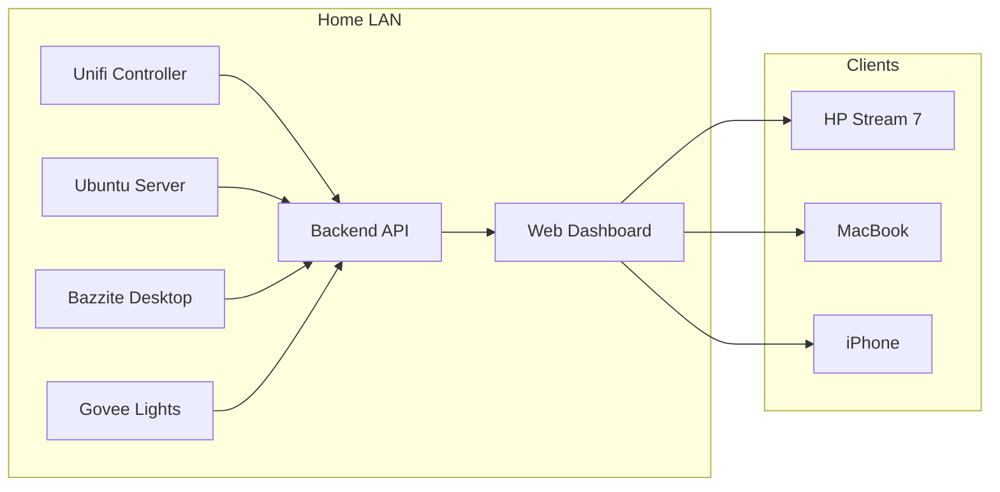
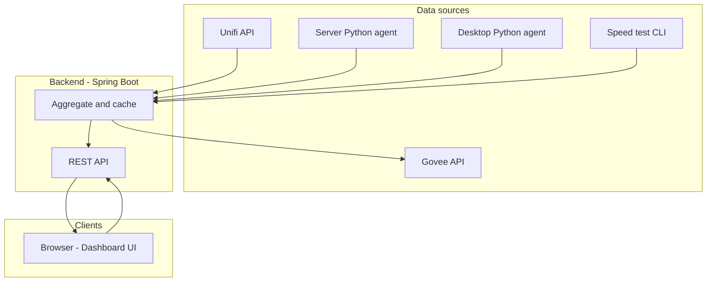
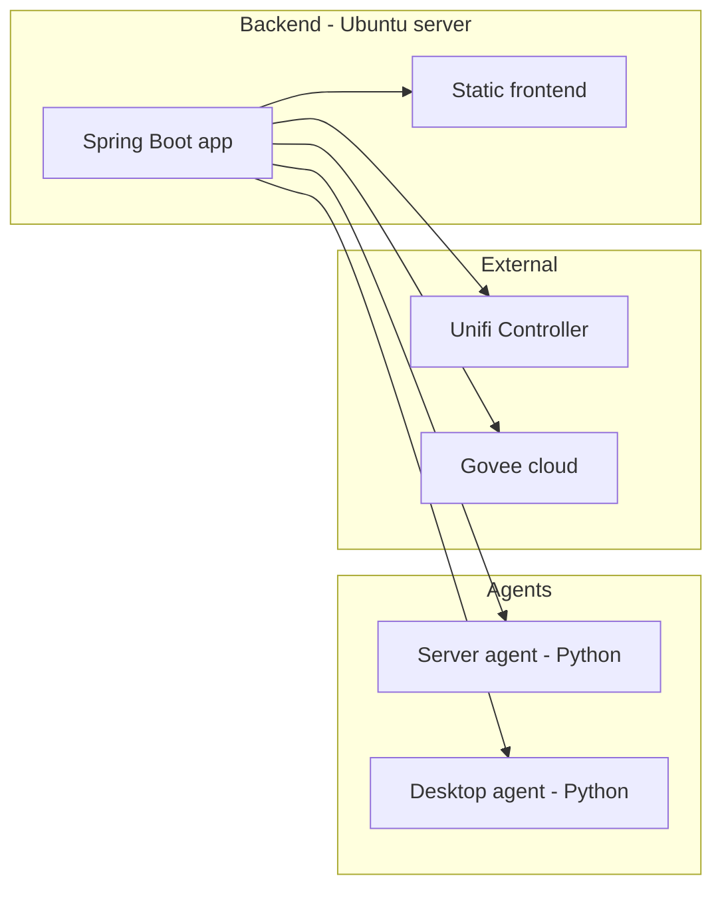
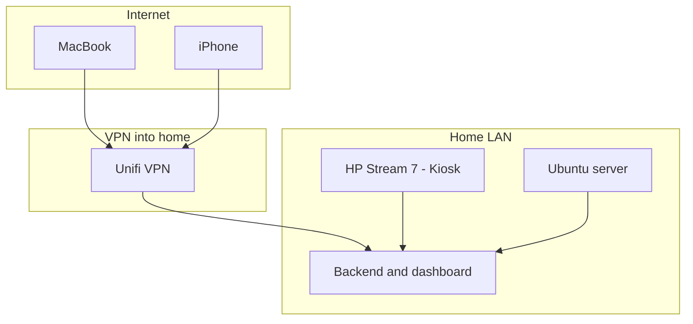
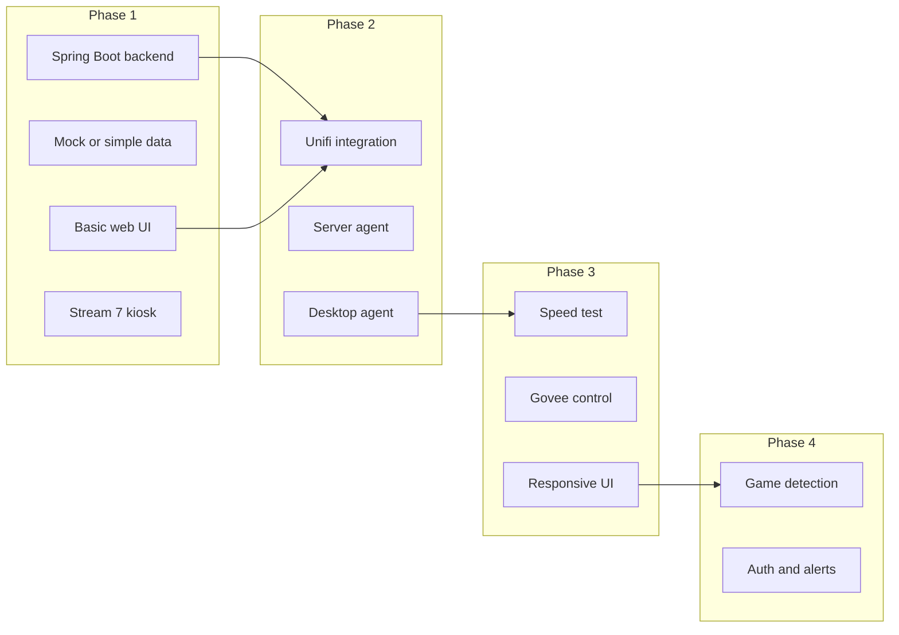
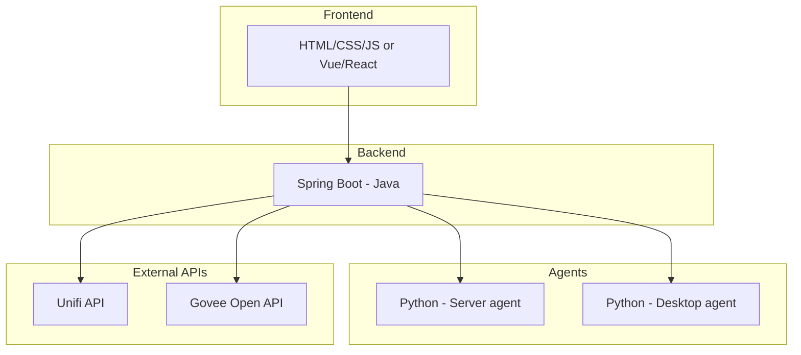

# Home monitoring hub – architecture diagrams

Reference diagrams for the home monitoring dashboard project. These can be rendered in any Markdown viewer that supports Mermaid (e.g. GitHub, Cursor, VS Code with a Mermaid extension).

---

## 1. High-level architecture

---

## 2. Data flow

---

## 3. Component view

---

## 4. Access and deployment

---

## 5. Phase roadmap

---

## 6. Tech stack overview

